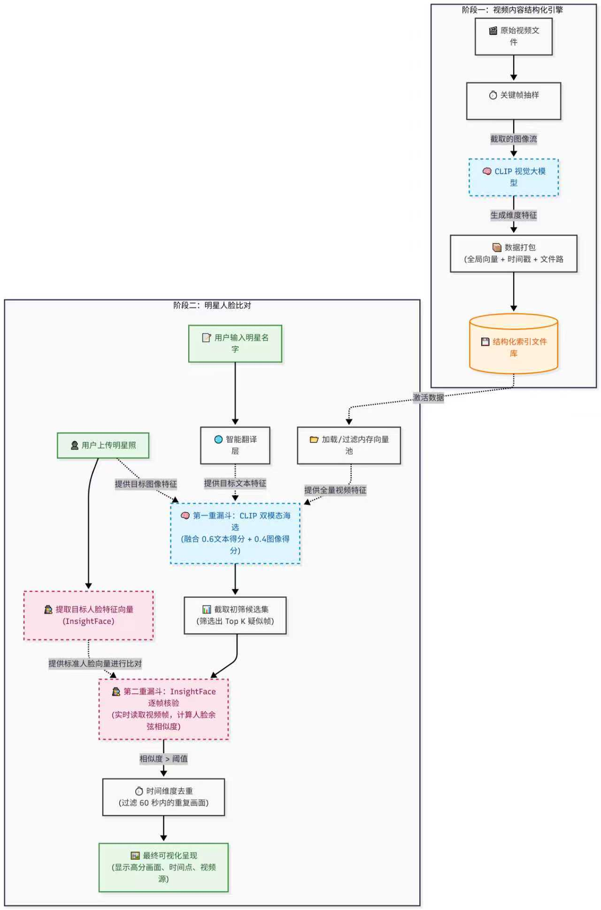

# 双引擎 AI 视频语义与人脸检索工具

一款结合了 Apple DFN5B-CLIP (用于自然语言场景检索) 与 InsightFace (用于人脸特征检索) 的纯本地视频检索引擎。

## 核心功能
- 场景语义搜索：输入自然语言描述，直接定位视频对应的画面。
- 目标人脸搜索：输入明星姓名并上传参考照片，引擎将结合“文本语义初筛”与“人脸特征逐帧比对”双重漏斗，精准定位该人物的登场片段。
- 纯本地运行：无需上传任何视频，保护隐私素材。自带国内镜像源加速。
- 自动翻译：支持直接输入中文，底层自动调用 API 翻译为英文输入给 CLIP 模型。

## 系统架构

### 1. 场景语义搜索架构

### 2. 目标人脸精准检索架构

## 硬件要求

由于本项目涉及大规模多模态视觉大模型（Apple DFN5B-CLIP）以及高频次的人脸特征提取，对电脑硬件有明确要求：
- 显卡配置（强推荐）：NVIDIA（英伟达）独立显卡，显存（VRAM）建议 6GB 或以上（如 RTX 3060/4060 及以上）。
- 计算环境：程序默认开启 GPU 加速，需要电脑具备 CUDA 运行环境。
- 内存要求：系统内存（RAM）建议 16GB 或以上。
- 关于纯 CPU 运行：虽然代码内置了 CPU 兼容逻辑，但纯 CPU 模式下视频抽帧与场景索引速度极慢，极不建议在无显卡的设备上跑这个工具。

## 安装步骤

0. 前置要求：确保您的电脑已安装 Python 3.9 - 3.11 版本，并已在系统环境变量中配置了 pip 命令。
1. 克隆代码或直接下载 ZIP 压缩包并解压进入文件夹。
2. 在项目根目录打开终端，安装依赖包：
   pip install -r requirements.txt

## 运行方法

运行语义场景搜索：
双击执行 启动场景搜索.bat

运行目标人脸搜索：
双击执行 启动明星搜索.bat

## 免责声明
本项目仅供本地技术研究与交流使用。请严格遵守相关法律法规，严禁将本工具用于侵犯他人隐私权、肖像权等非法用途。因不当使用造成的任何法律后果由使用者自行承担。

## 开源协议
本项目采用 MIT 许可证，详情请参阅 LICENSE 文件。

## 相关工具推荐
* [AIVidNote](https://www.aividnote.com/app/)：作者开发的 AI 视频总结 SaaS 工具网站。如果您恰好有“长视频内容提取与总结”的需求，欢迎来此体验。
